# Paragraph-Native Siddhant Architecture

> **Design principle**: If Siddhant were being built from scratch today, with the numbered paragraph as the fundamental unit of legal knowledge, what would the ideal design be?

---

## 1. Core Model

### 1.1 What is a paragraph?

A paragraph is the atomic unit of legal knowledge in Siddhant. It is:

- **A single coherent claim, definition, or explanation** — one intellectual object
- **Independently editable** — a contributor improves ¶7 without touching ¶6 or ¶8
- **Independently citable** — a scholar cites `Siddhant, Article 14, ¶7`
- **Independently linkable** — an edge points to ¶7, not to the whole node
- **Independently discussable** — a question can be attached to ¶7

A paragraph is NOT:

- A sentence (too small — sentences don't carry standalone meaning)
- A section (too large — sections contain multiple ideas)
- A heading (headings are navigational, not substantive)

The test for "is this a paragraph?" is: *can a reader understand this block in isolation, with minimal context?*

### 1.2 Paragraph fields

```sql
create table public.paragraphs (
  id            uuid default uuid_generate_v4() primary key,
  node_id       uuid references public.nodes on delete cascade not null,
  stable_id     text not null,             -- Permanent opaque identifier (e.g., 'p_a81f2c')
  display_number text not null,            -- Human-facing number (e.g., '7', '7A', '14.3')
  marginal_note text,                      -- Short topical label (author-provided)
  content       text not null,             -- Markdown content of this paragraph
  group_label   text,                      -- Optional grouping (see §2 discussion)
  order_index   integer not null,          -- Position within the node
  created_by    uuid references public.profiles,
  created_at    timestamptz default now(),
  updated_at    timestamptz default now(),
  deleted_at    timestamptz,               -- Soft delete (preserves references)

  unique(node_id, stable_id),
  unique(node_id, display_number)          -- No two paragraphs share a number within a node
);

create index idx_paragraphs_node_order on paragraphs(node_id, order_index)
  where deleted_at is null;
```

### 1.3 How is a paragraph identified internally?

**Two identity layers:**

| Layer | Field | Purpose | Mutability |
|-------|-------|---------|------------|
| **Database ID** | `id` (uuid) | Foreign keys, joins | Never changes |
| **Stable ID** | `stable_id` (text) | URL fragments, API references | Never changes |
| **Display number** | `display_number` (text) | Human citation, reading navigation | Never changes after assignment |

The `stable_id` is generated on paragraph creation: `p_` + 6 random alphanumeric characters (e.g., `p_k7m2x9`). It never changes, even if the paragraph is reordered, renumbered, or moved between nodes.

The `id` (uuid) is used for database relationships. The `stable_id` is used in URLs and exports.

### 1.4 How is a paragraph numbered for display?

**Display numbers are permanent labels, not computed positions.**

When a paragraph is created, it receives a `display_number` that becomes its permanent identity in the scholarly record. This number never changes.

**Assignment rules:**

1. **First authoring**: Paragraphs are numbered sequentially: `1, 2, 3, 4, ...`
2. **Insertion between existing paragraphs**: Suffixed with letters. Between ¶3 and ¶4 → `3A`. Between ¶3 and ¶3A → `3AA`.
3. **Deletion**: The number is retired. ¶5 is deleted → ¶5 shows as `[Removed]`. No renumbering occurs.
4. **Never renumber**: If someone cites `¶7` in a journal article, that reference must remain valid permanently.

This follows the convention used in Indian legal codes. Section 498A of the IPC was inserted between 498 and 499. It has remained 498A for decades. Legal practitioners understand this convention.

> [!IMPORTANT]
> Display numbers are stored strings, not integers. They can contain letters, dots, and other characters. The `order_index` (integer) controls actual rendering order.

### 1.5 How are marginal notes stored?

**As an author-provided text field on the paragraph.**

```
marginal_note text  -- e.g., "Classification Test", "Rational Nexus", "Held"
```

- The marginal note is written by the contributor when creating or editing the paragraph
- It is displayed in the left margin beside the paragraph number
- It is optional — paragraphs without marginal notes display only the number
- It is editable independently of paragraph content (a marginal note edit is a lightweight revision)
- Marginal notes are indexed for search

The marginal note is NOT auto-extracted from content. The prototype proved that auto-extraction produces poor results because the content was not authored with marginal notes in mind. In a paragraph-native system, authors write the marginal note as part of the authoring act.

---

## 2. Node Structure

### Option A: Flat — Node → Paragraphs

```
Node: Right to Equality (Article 14)
  ¶1   Meaning of equality
  ¶2   Historical origins
  ¶3   Influence of U.S. law
  ¶4   Rational nexus
  ¶5   Intelligible differentia
  ¶6   Object of legislation
  ¶7   Early judicial approach
  ¶8   Modern expansion
  ¶9   Current position
```

Every paragraph belongs directly to a node. No intermediate grouping layer.

**Navigational grouping via `group_label`:**

Paragraphs can optionally carry a `group_label` — a plain text field that creates visual grouping in the rendered output:

```
¶1   Meaning of equality         [group: Preliminary]
¶2   Historical origins          [group: Preliminary]
¶3   Influence of U.S. law       [group: Preliminary]
¶4   Rational nexus              [group: Classification Test]
¶5   Intelligible differentia    [group: Classification Test]
```

Group labels are denormalized metadata on each paragraph. They create visual separators in the UI but are not structural entities. They have no `id`, no table, no foreign keys.

### Option B: Hierarchical — Node → Section → Paragraphs

```
Node: Right to Equality (Article 14)
  § Preliminary
    ¶1   Meaning of equality
    ¶2   Historical origins
    ¶3   Influence of U.S. law
  § Classification Test
    ¶4   Rational nexus
    ¶5   Intelligible differentia
    ¶6   Object of legislation
```

Paragraphs belong to sections. Sections belong to nodes. Two levels of hierarchy.

```sql
-- Option B requires the existing article_sections table
-- plus a section_id FK on paragraphs:
paragraphs.section_id uuid references article_sections(id) on delete set null
```

### Comparison

| Dimension | Option A (Flat) | Option B (Hierarchical) |
|-----------|----------------|------------------------|
| **Schema complexity** | One table (`paragraphs`). One relationship (`node → paragraph`). | Three tables (`nodes`, `article_sections`, `paragraphs`). Two relationships. |
| **Query complexity** | `select * from paragraphs where node_id = X order by order_index` | Requires join or two queries: sections then paragraphs per section. |
| **Navigation** | `group_label` provides visual grouping. No TOC hierarchy. For long nodes, a flat list of ¶ numbers with marginal notes IS the TOC. | Sections provide a formal two-level TOC. Better for very long nodes (50+ paragraphs). |
| **Edge targeting** | Edges → paragraph. Simple. One FK. | Edges → section OR paragraph. Two nullable FKs. Ambiguity: does an edge to a section mean "all paragraphs in this section"? |
| **Contributor experience** | Extremely clear. "Edit ¶7." No confusion about sections vs paragraphs. | Potential confusion: "Should I edit the section or the paragraph?" Contributors must understand two levels. |
| **Contributor friction** | Create a paragraph: choose position, write content, write marginal note. Done. | Create a paragraph: choose section, then choose position within section, write content. Extra decision. |
| **Reordering** | Move ¶7 anywhere. Change `order_index`. Done. | Moving ¶7 to a different section requires changing `section_id` AND `order_index`. Cross-section moves are structurally complex. |
| **Migration from current system** | Parse markdown into paragraphs. Map headings to `group_label`. Drop `article_sections`. | Parse markdown into paragraphs. Keep `article_sections`. Add FK. More mapping work. |
| **Long-term scalability** | Group labels evolve organically. No structural migration needed when groups change. | Sections are structural — adding/removing/renaming sections requires maintaining FK integrity, handling orphans. |
| **Seervai fidelity** | Seervai's books are flat: Chapter 9 contains ¶9.1–¶9.250. There are no sub-sections within chapters. | Seervai does NOT use sections within chapters. The hierarchy is: Volume → Chapter → Paragraphs. |

### Recommendation: Option A (Flat)

Option A is the stronger design for three reasons:

**1. It matches the Seervai model.** In Seervai's *Constitutional Law of India*, each chapter is a flat sequence of numbered paragraphs. There are no sections within chapters. The marginal note IS the navigational unit. When you open the table of contents, you see:

```
Chapter 9 — Right to Equality
  9.1   The right stated
  9.2   Article 14 — text
  9.3   Meaning of equality
  ...
```

This is Option A. Siddhant's `Node` is Seervai's `Chapter`. Siddhant's `¶` is Seervai's numbered paragraph.

**2. It eliminates a class of problems.** With Option B, every operation that involves sections creates ambiguity:
- What does it mean to "edit a section"? Edit the section title? Add a paragraph to it?
- What happens when a section is deleted? Are its paragraphs deleted, orphaned, or reassigned?
- Can a paragraph exist without a section? If not, what's the "default section"?

Option A has none of these questions. Every paragraph belongs to a node. Period.

**3. Group labels provide the navigation benefit without the structural cost.** If you need to visually separate "Preliminary" paragraphs from "Classification Test" paragraphs, `group_label` does that in the UI. But unlike sections, group labels:
- Are just strings — no table, no foreign keys, no orphan risk
- Can be changed by editing any paragraph's metadata
- Don't create structural dependencies for edges, revisions, or search

---

## 3. Editing

### 3.1 How would a contributor edit a single paragraph?

**Each paragraph has an edit affordance in the reader view.**

```
¶7   Classification Test

     The concept of equality does not mean that all persons
     are equal...

     ┌─────────────────────────────────────────────┐
     │ ✏️ Edit ¶7    💬 Discuss    🔗 Copy link    │
     └─────────────────────────────────────────────┘
```

Clicking "Edit ¶7" opens a **focused paragraph editor**:

```
┌──────────────────────────────────────────────────────┐
│  Editing ¶7 — Classification Test                     │
│  Node: Right to Equality (Article 14)                 │
│                                                       │
│  Marginal Note: [Classification Test           ]      │
│                                                       │
│  Content:                                             │
│  ┌──────────────────────────────────────────────────┐ │
│  │ The concept of equality does not mean that all   │ │
│  │ persons are equal...                             │ │
│  └──────────────────────────────────────────────────┘ │
│                                                       │
│  Revision Intent: [Clarification        ▾]            │
│  Summary: [Adding AIR citation          ]             │
│                                                       │
│  [Save ¶7]                      [Cancel]              │
└──────────────────────────────────────────────────────┘
```

The editor shows ONLY this paragraph. The contributor cannot accidentally modify ¶6 or ¶8.

The save creates a **paragraph revision** (see §7).

### 3.2 How would new paragraphs be inserted?

**"Add paragraph" appears between every pair of existing paragraphs.**

```
¶6   Object of legislation
     ...

     [ + Add paragraph here ]       ← visible on hover or always

¶7   Early judicial approach
     ...
```

Clicking opens the paragraph editor in creation mode:

- **Display number**: auto-suggested based on position. Between ¶6 and ¶7 → `6A`. The author can accept or override.
- **Marginal note**: required field (this is what makes the system work)
- **Content**: the paragraph text
- **Group label**: inherited from the preceding paragraph, editable

### 3.3 How would paragraphs be reordered?

**By changing `order_index`, NOT by changing `display_number`.**

If ¶7 is moved above ¶4, the rendering order changes but both paragraphs keep their original display numbers. The reader sees:

```
¶7   Early judicial approach     ← was below, now above
¶4   Rational nexus              ← was above, now below
```

This is unusual but intentional. Legal codes do this: Section 498A appears between 498 and 499, not in numerical order by content creation date.

The rationale: **external citations must survive reordering.** If a journal article says "See Siddhant, Article 14, ¶7", that must always point to "Early judicial approach" regardless of where it sits in the rendered order.

Reordering is a privileged operation (Level 2+ contributor) because it affects reading flow without changing content.

### 3.4 How would numbering remain stable over time?

**Three invariants:**

1. **Display numbers are immutable after creation.** ¶7 is always ¶7. Even if the paragraph is edited, reordered, or the node is restructured.

2. **Deleted paragraphs leave tombstones.** If ¶5 is deleted, the number 5 is retired. The reader sees:

   ```
   ¶4   ...
   ¶5   [This paragraph was removed in revision of 2026-07-15]
   ¶6   ...
   ```

   This is how legal codes handle repealed sections. Section 309 of IPC was "deleted" but the number persists with an annotation.

3. **Insertions use suffixes, never renumbering.** Between ¶3 and ¶4 → `3A`. Between ¶3 and ¶3A → `3B` (NOT `3AA`). The suffix sequence is: A, B, C, ..., Z, AA, AB, ...

**Why this works for collaborative editing:** Two contributors inserting simultaneously between ¶3 and ¶4 would both get suffix assignments. If they collide (both get `3A`), the second save gets `3B`. The system handles this at the database level via the unique constraint `(node_id, display_number)` — if insert fails on conflict, retry with next suffix.

---

## 4. Citations

### 4.1 How should users cite a paragraph?

**Standard citation format:**

```
Siddhant, [Node Title], ¶[display_number] (rev. [YYYY-MM-DD])
```

**Examples:**

```
Siddhant, Article 14, ¶7 (rev. 2026-06-01)
Siddhant, Maneka Gandhi v. Union of India, ¶12A (rev. 2026-06-01)
Siddhant, Doctrine of Basic Structure, ¶3 (rev. 2026-06-01)
```

The revision date pins the citation to a specific point in time. Without it, the citation refers to the current version.

**"Cite ¶7" button**: Each paragraph's action bar includes a copy-to-clipboard citation button that produces the formatted citation string.

### 4.2 How should URLs point to a paragraph?

**URL format:**

```
/topic/{node-slug}#p-{display_number}
```

**Examples:**

```
/topic/article-14#p-7
/topic/article-14#p-7A
/topic/maneka-gandhi-v-union-of-india#p-12
```

**With revision pinning:**

```
/topic/article-14?revision={revision-id}#p-7
```

The hash fragment uses `display_number` (not `stable_id`) because display numbers are what humans see and cite. The browser scrolls to the element with `id="p-7"`.

Internally, the system resolves `display_number` → `stable_id` → `id` for database operations. This indirection means that even if display number encoding changes in the future, the `stable_id` provides a fallback resolution path.

### 4.3 How should paragraph references survive future edits?

| Scenario | What happens to `¶7` | Citation validity |
|----------|----------------------|-------------------|
| ¶7 content is edited | ¶7 still exists, new revision | ✅ Valid (content changed, citation still points to ¶7) |
| ¶7 is reordered | ¶7 moves position but keeps number | ✅ Valid |
| ¶7 is deleted | Tombstone: "¶7 was removed" | ⚠️ Valid but shows removal notice |
| New paragraph inserted before ¶7 | New paragraph gets suffix (e.g., ¶6A) | ✅ Valid (¶7 unchanged) |
| Entire node is deleted | All paragraphs deleted | ❌ Broken (same as current node deletion) |

---

## 5. Edges

### 5.1 How should edges target paragraphs?

**Add `target_paragraph_id` to `cross_references`:**

```sql
alter table cross_references
  add column target_paragraph_id uuid
  references paragraphs(id) on delete set null;
```

An edge can target:
- **A node** (`target_node_id` only, `target_paragraph_id` null) — "This case interprets Article 14"
- **A paragraph** (`target_node_id` + `target_paragraph_id`) — "This case interprets ¶7 of Article 14"

### 5.2 Should edges target paragraphs, sections, or both?

**Paragraphs only.** In Option A there are no sections as structural entities. If a contributor wants to link to "the Classification Test discussion," they link to ¶4 (the first paragraph about classification) or to multiple individual paragraphs.

Group labels are not addressable targets. They are display-only metadata.

### 5.3 How would existing section-based edges migrate?

Current state: `cross_references.target_section_id` → `article_sections.id`

**Migration strategy:**

1. For each edge with a `target_section_id`, find the section's first paragraph (by `order_index` after content migration)
2. Set `target_paragraph_id` to that paragraph's `id`
3. Set `target_section_id` to null
4. After all edges are migrated, drop the `target_section_id` column

Edges without `target_section_id` (node-level edges) remain unchanged.

This is a mechanical migration — no human review needed.

---

## 6. Discussions

### 6.1 Should discussions attach to nodes or paragraphs?

**Both, with clear distinction:**

| Discussion type | Attaches to | Purpose |
|----------------|-------------|---------|
| **General discussion** | Node | "Should this article cover X?" — structural, organizational |
| **Paragraph comment** | Paragraph | "This claim needs a citation" — substantive, specific |

```sql
alter table discussions
  add column paragraph_id uuid references paragraphs(id) on delete set null;
```

If `paragraph_id` is null, the discussion is node-level. If set, it's a paragraph comment.

### 6.2 Can a user comment on a specific paragraph?

**Yes.** Each paragraph's action bar includes "Discuss ¶7". Clicking it:

1. Opens a thread view filtered to discussions where `paragraph_id = ¶7.id`
2. New comments in this view automatically set `paragraph_id`
3. The paragraph rendered view shows a small indicator: `¶7 💬2` (2 comments)

### 6.3 What are the moderation implications?

Paragraph-level discussions are **easier** to moderate than node-level discussions because:

- Each comment has a clear context (the specific paragraph it's about)
- Moderators can see at a glance whether the comment is relevant
- "Is this comment about the content?" becomes trivial when the content is one paragraph

The main new moderation concern: **discussion fragmentation**. If every paragraph has its own thread, conversations about related paragraphs might split across multiple threads. Mitigation: the node-level discussion remains available for cross-paragraph conversations.

---

## 7. Revisions

### 7.1 Should revisions operate at node level, paragraph level, or both?

**Both. Dual-layer revision model.**

#### Layer 1: Paragraph Revisions (primary authoring unit)

Every paragraph edit creates a paragraph revision:

```sql
create table public.paragraph_revisions (
  id             uuid default uuid_generate_v4() primary key,
  paragraph_id   uuid references paragraphs(id) on delete cascade not null,
  author_id      uuid references profiles not null,
  content        text not null,           -- Full paragraph content at this revision
  marginal_note  text,                    -- Marginal note at this revision
  commit_message text not null,
  revision_type  text default 'content_edit',  -- content_edit, marginal_note_edit, creation, deletion
  content_size   integer,
  created_at     timestamptz default now()
);
```

This is the primary record. When you "Edit ¶7", a new `paragraph_revisions` row is created. The diff is trivially focused: old ¶7 content vs. new ¶7 content.

#### Layer 2: Node Snapshots (rollback and history)

Periodically (or on structural changes like reordering, insertion, deletion), a node-level snapshot is captured:

```sql
create table public.node_snapshots (
  id             uuid default uuid_generate_v4() primary key,
  node_id        uuid references nodes on delete cascade not null,
  triggered_by   uuid references paragraph_revisions,  -- Which paragraph edit triggered this
  snapshot_data  jsonb not null,           -- Full ordered list of paragraph IDs + display_numbers
  author_id      uuid references profiles,
  snapshot_type  text default 'auto',      -- auto, manual, structural_change
  created_at     timestamptz default now()
);
```

`snapshot_data` is a lightweight JSON array:

```json
[
  { "paragraph_id": "...", "stable_id": "p_k7m2x9", "display_number": "1", "order_index": 0 },
  { "paragraph_id": "...", "stable_id": "p_r3n8q1", "display_number": "2", "order_index": 1 },
  ...
]
```

This enables "view node as of date X" and "revert node to snapshot Y" without storing duplicate paragraph content.

### 7.2 How would review and moderation work?

**Paragraph revisions are the review unit.**

The current review pipeline (contribution review drawer, peer review panel) operates on revisions. In the new model:

1. A paragraph edit creates a `paragraph_revision`
2. The revision appears in the review queue showing:
   - **Which paragraph** was edited (¶7 — Classification Test)
   - **What changed** (diff of old vs. new paragraph content)
   - **Who edited** (author, role level)
   - **Why** (commit message)
3. Reviewers approve/reject at the paragraph level
4. The 72-hour acceptance timer runs per paragraph revision

This is **dramatically easier** to review than the current system, where a revision might change 5 different paragraphs scattered across a 3000-character document, and the reviewer must find all changes.

**Revert granularity:** A moderator can revert a single paragraph to its previous state without affecting any other paragraphs. Currently, reverting a node revision reverts ALL content.

---

## 8. Migration

### 8.1 How would existing nodes be converted?

**Migration script: markdown → paragraphs**

For each node with `report_content`:

1. Split content by double newlines (`\n\n`) — same as `renderMarkdownParagraphs()` already does
2. For each block:
   - If it's a heading → becomes the `group_label` for subsequent paragraphs AND the `marginal_note` for the first paragraph in that group
   - If it's a paragraph → becomes a `paragraphs` row
   - If it's a list → becomes a single paragraph (lists are not split)
   - If it's a blockquote → becomes a single paragraph
   - If it's a `:::legal` block → becomes a single paragraph with a flag
3. Assign sequential `display_number` values: `1, 2, 3, ...`
4. Generate `stable_id` for each
5. Create one `paragraph_revision` per paragraph (type: `migration`)
6. Create one `node_snapshot` capturing the initial state

### 8.2 How would existing sections be handled?

**Map sections to `group_label` values, then drop the table.**

1. For each `article_sections` row, find the paragraphs that were under that heading
2. Set `group_label` on those paragraphs to the section's `title`
3. Migrate any `cross_references.target_section_id` to `target_paragraph_id` (first paragraph of that section)
4. Drop the `article_sections` table and the `target_section_id` column

### 8.3 What content patterns will require manual cleanup?

| Pattern | Problem | Solution |
|---------|---------|----------|
| **Headings as standalone blocks** | A `## Classification Test` heading becomes a paragraph with no body text | Auto-merge: if a paragraph is just a heading, merge it with the next paragraph and use the heading as `marginal_note` |
| **Very short paragraphs** | Some authors write single-sentence "paragraphs" that don't carry standalone meaning | Flag for review but don't auto-merge (short ≠ meaningless in legal writing) |
| **Deeply nested lists** | A single numbered list with 20 items becomes one giant paragraph | Preserve as-is. Lists are often a single intellectual unit (e.g., "elements of the offence") |
| **Legal text blocks** (`:::legal`) | Statutory text quoted verbatim | Preserve as a single paragraph, tagged as `legal_text` |
| **Empty paragraphs** | Whitespace-only blocks between content | Skip during migration |
| **Inline section slugs** (`{#sec_xxxx}`) | Infrastructure tokens embedded in content | Strip during migration (they become `stable_id` values on paragraphs) |

Estimated manual cleanup: **5-10% of existing content** will need human review. The migration script should flag ambiguous cases for manual resolution rather than guessing.

### 8.4 What is the estimated implementation effort?

| Phase | Work | Effort | Dependencies |
|-------|------|--------|--------------|
| **1. Database schema** | Create `paragraphs`, `paragraph_revisions`, `node_snapshots` tables. Add `target_paragraph_id` to `cross_references`. Add `paragraph_id` to `discussions`. RLS policies. | 2-3 days | None |
| **2. Paragraph editor** | Focused single-paragraph editor component. Save action creates paragraph revision. Marginal note input field. | 5-7 days | Phase 1 |
| **3. Reader rendering** | Replace `ReportContent` to render from `paragraphs` table instead of `report_content` blob. Paragraph numbers, marginal notes, group labels, hover action bar. | 3-4 days | Phase 1 |
| **4. Content migration** | Script to split existing `report_content` into paragraph rows. Map sections to group labels. Handle edge cases. | 3-5 days | Phase 1 |
| **5. Edge migration** | Migrate `target_section_id` → `target_paragraph_id`. Update edge form to show paragraphs instead of sections. | 2-3 days | Phase 4 |
| **6. History & review** | Paragraph revision history page. Update contribution review drawer to show paragraph-level diffs. | 3-4 days | Phase 2 |
| **7. Discussion integration** | Add paragraph-level discussion threading. Comment indicators on paragraphs. | 2-3 days | Phase 2 |
| **8. Node snapshot system** | Auto-snapshot on structural changes. Snapshot viewer. Node-level revert from snapshot. | 2-3 days | Phase 2 |
| **9. Search** | Index `paragraphs.content` and `marginal_note` for full-text search. Return paragraph-level results. | 2-3 days | Phase 4 |
| **10. Citation system** | "Cite ¶7" button. Citation format generation. Permalink with revision pinning. | 1-2 days | Phase 3 |
| **11. Cleanup & QA** | Manual review of flagged migrations. Bug fixes. Edge cases. Performance testing. | 3-5 days | All phases |
| **Total** | | **~28-42 days (6-9 weeks)** | |

> [!WARNING]
> Phase 2 (paragraph editor) and Phase 4 (content migration) are the two highest-risk items. The editor is the most complex new code. The migration handles all existing content and must not lose or corrupt data. Both should be developed with extensive automated tests.

### Phased rollout recommendation

1. **Phases 1-4 first** (schema + editor + rendering + migration): This delivers the core paragraph-native experience. Estimated: 4-5 weeks.
2. **Phase 5-7 next** (edges + history + discussions): These integrate paragraphs into the existing platform features. Estimated: 2 weeks.
3. **Phases 8-10 last** (snapshots + search + citations): Polish and completeness. Estimated: 1-2 weeks.

---

## Appendix: Schema Summary

```mermaid
erDiagram
    nodes ||--o{ paragraphs : "contains"
    paragraphs ||--o{ paragraph_revisions : "history"
    nodes ||--o{ node_snapshots : "snapshots"
    cross_references }o--|| paragraphs : "targets"
    discussions }o--o| paragraphs : "comments on"
    profiles ||--o{ paragraph_revisions : "authors"

    nodes {
        uuid id PK
        text slug
        text title
        text node_type
        jsonb metadata
    }

    paragraphs {
        uuid id PK
        uuid node_id FK
        text stable_id
        text display_number
        text marginal_note
        text content
        text group_label
        int order_index
        uuid created_by FK
    }

    paragraph_revisions {
        uuid id PK
        uuid paragraph_id FK
        uuid author_id FK
        text content
        text marginal_note
        text commit_message
        text revision_type
    }

    node_snapshots {
        uuid id PK
        uuid node_id FK
        jsonb snapshot_data
        text snapshot_type
    }
```


