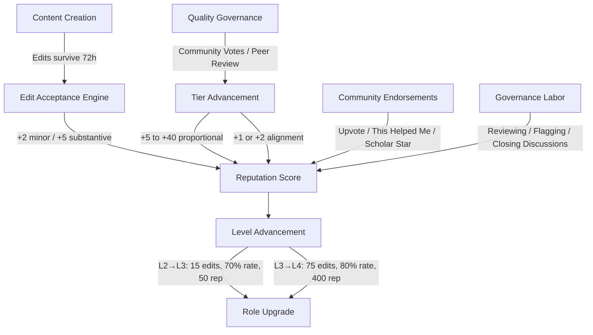

# Siddhant Platform — Quality, Peer Review & Reputation: Full Technical Audit

> **Scope:** Every file, function, SQL procedure, and UI component that creates, awards, or displays reputation points.
> **Auditor standard:** Would a law firm, judiciary, or corporate recruiter trust this number on a résumé?

---

## Part 1: Architecture Overview

The Siddhant reputation economy has **three pillars**:



### Source Files

| File | Role |
|------|------|
| [reputation-constants.ts](file:///c:/Users/Nipun/OneDrive/Desktop/Legal%20Platfrom%20-%20AG/src/app/actions/reputation-constants.ts) | Point values, level thresholds — single source of truth |
| [reputation.ts](file:///c:/Users/Nipun/OneDrive/Desktop/Legal%20Platfrom%20-%20AG/src/app/actions/reputation.ts) | Core engine: `awardReputation()`, `checkLevelAdvancement()`, `acceptEdit()` |
| [contributions.ts](file:///c:/Users/Nipun/OneDrive/Desktop/Legal%20Platfrom%20-%20AG/src/app/actions/contributions.ts) | Upvotes, endorsements, Scholar Stars |
| [edit-acceptance.ts](file:///c:/Users/Nipun/OneDrive/Desktop/Legal%20Platfrom%20-%20AG/src/app/actions/edit-acceptance.ts) | 72-hour lazy evaluation for edit acceptance |
| [quality-voting.ts](file:///c:/Users/Nipun/OneDrive/Desktop/Legal%20Platfrom%20-%20AG/src/app/actions/quality-voting.ts) | Community blind voting (Draft → Solid) |
| [peer-review.ts](file:///c:/Users/Nipun/OneDrive/Desktop/Legal%20Platfrom%20-%20AG/src/app/actions/peer-review.ts) | Formal peer review (Good Article / Featured) |
| [quality.ts](file:///c:/Users/Nipun/OneDrive/Desktop/Legal%20Platfrom%20-%20AG/src/app/actions/quality.ts) | Legacy individual assessment (GA/Featured blocked) |
| [quality_governance_migration.sql](file:///c:/Users/Nipun/OneDrive/Desktop/Legal%20Platfrom%20-%20AG/quality_governance_migration.sql) | `cast_quality_vote` RPC — consensus computation |
| [peer_review_patch.sql](file:///c:/Users/Nipun/OneDrive/Desktop/Legal%20Platfrom%20-%20AG/peer_review_patch.sql) | `close_review_cycle` RPC — tier advancement, challenge, reputation |
| [peer_review_migration.sql](file:///c:/Users/Nipun/OneDrive/Desktop/Legal%20Platfrom%20-%20AG/peer_review_migration.sql) | `submit_peer_review` RPC — review + reputation |
| [reputation_rpc_fix.sql](file:///c:/Users/Nipun/OneDrive/Desktop/Legal%20Platfrom%20-%20AG/reputation_rpc_fix.sql) | `award_reputation_points`, `increment_profile_counter`, `update_user_role` RPCs |

---

## Part 2: Complete Reputation Point Catalogue

### Every Way to Earn Points (Verified Against Live Code)

| # | Event | Points | Where Awarded | Dedup Check | Effort Required |
|---|-------|--------|---------------|-------------|-----------------|
| 1 | Minor edit accepted (< 50 chars) | **+2** | `reputation.ts` → `acceptEdit()` → RPC | `acceptance_processed` flag on revision | Low |
| 2 | Substantive edit accepted (≥ 50 chars) | **+5** | `reputation.ts` → `acceptEdit()` → RPC | `acceptance_processed` flag on revision | Medium |
| 3 | Upvote received | **+1** | `contributions.ts` → `toggleUpvote()` | Toggle (can remove) | **None** |
| 4 | "This Helped Me" endorsement | **+10** | `contributions.ts` → `toggleEndorsement()` | Toggle (can remove) | **None** |
| 5 | Scholar Star received | **+15** | `contributions.ts` → `awardScholarStar()` | None — unlimited awards possible | Low (20 chars) |
| 6 | Peer review completed | **+3** | `peer_review_migration.sql` → `submit_peer_review()` | `UNIQUE(cycle_id, reviewer_id)` | High |
| 7 | Vote aligned with community consensus | **+1** | `quality_governance_migration.sql` → `cast_quality_vote()` | `NOT EXISTS` per tier per node | Medium |
| 8 | Peer review aligned with outcome | **+2** | `peer_review_patch.sql` → `close_review_cycle()` | One per review | High |
| 9 | Discussion cited in closing summary | **+5** | `discussion/actions.ts` → `closeDiscussion()` | None — **carpet-bombs all participants** | Medium |
| 10 | Flag resolved | **+2** | `api/resolve-tag/route.ts` | Only if flagger ≠ resolver | Medium |
| 11 | Tier advancement bonus (Draft→Developing) | **+5** base, proportional | `cast_quality_vote` RPC | `NOT EXISTS` per author per tier per node | N/A (passive) |
| 12 | Tier advancement bonus (Developing→Useful) | **+8** base, proportional | `cast_quality_vote` RPC | `NOT EXISTS` per author per tier per node | N/A (passive) |
| 13 | Tier advancement bonus (Useful→Solid) | **+12** base, proportional | `cast_quality_vote` RPC | `NOT EXISTS` per author per tier per node | N/A (passive) |
| 14 | Tier advancement bonus (Solid→Good Article) | **+25** base, proportional | `close_review_cycle` RPC | `NOT EXISTS` per author per tier per node | N/A (passive) |
| 15 | Tier advancement bonus (Good Article→Featured) | **+40** base, proportional | `close_review_cycle` RPC | `NOT EXISTS` per author per tier per node | N/A (passive) |

---

## Part 3: Quality Governance — How Tiers Move

### Track 1: Community Blind Voting (Draft → Solid)

| Step | What Happens | Where |
|------|-------------|-------|
| 1 | User opens article → sees "🗳 Vote on Quality" | `QualityVoting.tsx` on topic page |
| 2 | Blind modal opens — no tally visible before vote | `getQualityVoteSummary` returns empty breakdown for non-voters |
| 3 | User selects tier (Draft/Developing/Useful/Solid) | Client validation |
| 4 | `castQualityVote()` server action fires | `quality-voting.ts` |
| 5 | RPC `cast_quality_vote` runs | `quality_governance_migration.sql` |
| 5a | Independence check: voter ≠ any revision author | SQL `EXISTS` check |
| 5b | Upsert vote (insert or update) | `ON CONFLICT (node_id, voter_id)` |
| 5c | Count total votes. If ≥ 3, compute majority tier | Simple `GROUP BY voted_tier ORDER BY COUNT(*) DESC` |
| 5d | If consensus tier ≠ current tier AND node in votable range: update | `UPDATE nodes SET quality_tier` |
| 5e | Award +1 alignment points to aligned voters | `NOT EXISTS` dedup |
| 5f | If tier went UP: award proportional contributor bonus | `NOT EXISTS` dedup per author per tier |
| 6 | After vote: breakdown revealed (transparent after voting) | RPC returns full breakdown |

### Track 2: Formal Peer Review (Good Article & Featured)

| Step | What Happens | Where |
|------|-------------|-------|
| 1 | Nominator initiates cycle | `initiateReviewCycle()` in `peer-review.ts` |
| 1a | Prerequisite check: node must be at `b_class` (GA) or `good_article` (Featured) | Server action |
| 1b | Duplicate check: no `open` or `awaiting_conclusion` cycle exists | `.in('status', ['open', 'awaiting_conclusion'])` |
| 1c | Snapshot latest `revision_id` | Stored on `review_cycles.snapshot_revision_id` |
| 2 | Reviewer submits structured review (6 criteria, 1-5 scale) | `submitPeerReview()` → `submit_peer_review` RPC |
| 2a | Independence: reviewer ≠ contributor, reviewer ≠ nominator | Server action checks |
| 2b | Level gate: L3+ for GA, L4+ for Featured | Server action |
| 2c | +3 rep awarded for completing the review | SQL `INSERT` in RPC |
| 2d | If `review_count >= min_reviews`: transition to `awaiting_conclusion` | Server action `UPDATE` |
| 3 | Senior Scholar (L4+) concludes the cycle | `concludeReviewCycle()` |
| 3a | Neutrality: concluder ≠ reviewer in this cycle | Server action |
| 3b | Independence: concluder ≠ contributor | Server action |
| 3c | 50+ char consensus summary required | Server action |
| 3d | `close_review_cycle` RPC determines outcome | `peer_review_patch.sql` |
| 3e | Alignment points (+2) to aligned reviewers | SQL loop |
| 3f | If `advanced`: update tier + award contributor bonus | `NOT EXISTS` dedup |
| 3g | If `downgraded` (challenge): demote tier + clear `quality_reviewed_revision_id` | SQL |

### Track 3: Quality Challenge (Anti-Staleness)

Same infrastructure as Track 2, but with `cycle_type = 'challenge'`. The node must *already be at* the challenged tier. Outcome logic is inverted: `meets_standard` → `maintained`, no meets → `downgraded`, mixed → `split`.

---

## Part 4: Independence & Integrity Matrix

| Action | Min Level | Author Blocked? | Nominator Blocked? | Reviewer Blocked? | Dedup |
|--------|-----------|-----------------|--------------------|--------------------|-------|
| Vote on quality | L2 | ✅ Yes (SQL) | N/A | N/A | One vote per user per node |
| Nominate for GA | L2 | ❌ Allowed | N/A | N/A | One open cycle per node |
| Nominate for Featured | L3 | ❌ Allowed | N/A | N/A | One open cycle per node |
| Review for GA | L3 | ✅ Yes | ✅ Yes | N/A | One review per cycle |
| Review for Featured | L4 | ✅ Yes | ✅ Yes | N/A | One review per cycle |
| Conclude cycle | L4 | ✅ Yes | ✅ Yes (via review rule) | ✅ Yes | Once per cycle |
| Challenge tier | L3/L4 | ❌ Allowed | N/A | N/A | One open cycle per node |
| Upvote revision | L1+ | ✅ (self-vote blocked) | N/A | N/A | Toggle per user per revision |
| Endorse revision | L1+ | ✅ (self-endorse blocked) | N/A | N/A | Toggle per user per revision |
| Award Scholar Star | L1+ | ✅ (self-award blocked) | N/A | N/A | **❌ NO DEDUP** |
| Close discussion | L4 | N/A | N/A | N/A | Closer ≠ participant |

---

## Part 5: Bugs & Loopholes Found

### 🔴 CRITICAL: Scholar Star Farming (No Dedup, No Rate Limit)

**File:** [contributions.ts](file:///c:/Users/Nipun/OneDrive/Desktop/Legal%20Platfrom%20-%20AG/src/app/actions/contributions.ts) lines 162-216

**The Problem:** User A can award **unlimited** Scholar Stars to User B. Each star is +15 rep. There is:
- No check for existing stars from the same giver to the same recipient
- No daily/weekly rate limit
- No cooldown period
- No minimum level requirement to give a star

**Attack Vector:** Two colluding accounts alternate giving each other Scholar Stars. 10 stars = 150 points. The `senior_scholar` threshold is 400 rep. A coordinated pair could reach L4 in days without writing a single word of legal content.

**Severity:** This alone can destroy the credibility of the entire reputation system.

---

### 🔴 CRITICAL: "This Helped Me" Toggle Abuse (+10 per click)

**File:** [contributions.ts](file:///c:/Users/Nipun/OneDrive/Desktop/Legal%20Platfrom%20-%20AG/src/app/actions/contributions.ts) lines 87-154

**The Problem:** The endorsement is toggleable (can add/remove), but reputation is awarded every time it's toggled ON. There is no check for "has this user already awarded endorsement rep for this revision before?"

**Attack Vector:** User A clicks "This Helped Me" → +10 rep awarded to User B. User A removes endorsement. User A clicks again → another +10 rep awarded. Infinite loop.

> [!CAUTION]
> Actually, on re-examination of the `awardReputation()` function in `reputation.ts`, the RPC `award_reputation_points` does **not** have any dedup check — it simply `INSERT`s a new `reputation_events` row and increments `reputation_score` every single time it is called. The toggle does not undo the reputation award. This means every toggle-on is a permanent +10 even if the user later removes the endorsement.

---

### 🔴 CRITICAL: Upvote Reputation Not Undone on Toggle-Off

**File:** [contributions.ts](file:///c:/Users/Nipun/OneDrive/Desktop/Legal%20Platfrom%20-%20AG/src/app/actions/contributions.ts) lines 20-80

**Same as above.** When an upvote is toggled ON, +1 rep is awarded. When toggled OFF (the `delete` path at line 35-39), no reputation is deducted. The points are permanent even after the action is reversed.

---

### 🟡 HIGH: Discussion Cited — Carpet Bomb (+5 to ALL participants)

**File:** [discussion/actions.ts](file:///c:/Users/Nipun/OneDrive/Desktop/Legal%20Platfrom%20-%20AG/src/app/topic/%5Bslug%5D/discussion/actions.ts) lines 111-129

**The Problem:** When a Senior Scholar closes a discussion, **every single participant** in the thread gets +5 `discussion_cited` points. There is no selection mechanism for the Senior Scholar to choose whose arguments actually contributed to the consensus.

**Impact:** If a thread has 20 participants and 18 of them posted "I agree" or "+1", all 20 get +5 points. This rewards low-effort participation equally with high-effort scholarly argument.

---

### 🟡 HIGH: `quality.ts` — Tier Advancement Bonus Has No Dedup Check

**File:** [quality.ts](file:///c:/Users/Nipun/OneDrive/Desktop/Legal%20Platfrom%20-%20AG/src/app/actions/quality.ts) lines 110-156

**The Problem:** The TypeScript `assessQualityTier()` function awards `tier_advancement_bonus` to contributors when a tier advances, but it calls `awardReputation()` which uses the generic `award_reputation_points` RPC. Unlike the SQL procedures (`cast_quality_vote` and `close_review_cycle`), the TypeScript path has **no `NOT EXISTS` dedup check**. However, since GA/Featured are blocked from this path (line 53), and the SQL RPCs for lower-tier voting handle their own dedup, this is partially mitigated. But the `assessQualityTier()` path (for individual L3 assessment to `b_class`) **can** double-award if called multiple times.

---

### 🟡 HIGH: All Users Treated Equally — No Weight Differentiation

**The Problem:** Every upvote is +1, every endorsement is +10, every Scholar Star is +15 — regardless of who gives it. An L1 Reader's endorsement has the exact same weight as an L4 Senior Scholar's endorsement. An account created yesterday has the same endorsement power as a 2-year veteran.

**Why This Matters:** X's Community Notes solved this exact problem with the bridging-based matrix factorization model. In Siddhant, two colluding L1 accounts can generate the same reputation impact as two genuine L4 Senior Scholars recognizing outstanding work. This fundamentally destroys credibility.

---

### 🟡 MEDIUM: Peer Review Alignment in `peer_review_migration.sql` — No Dedup

**File:** [peer_review_migration.sql](file:///c:/Users/Nipun/OneDrive/Desktop/Legal%20Platfrom%20-%20AG/peer_review_migration.sql) lines 290-315

**The Problem:** The `close_review_cycle` function in the *migration* file (the older version) awards alignment rep **without** the `NOT EXISTS` dedup check. The *patch* file (`peer_review_patch.sql`) has this same structure. If the `close_review_cycle` is somehow executed from the migration version instead of the patch version, alignment points could be duplicated.

**Mitigation:** This is only a risk if someone runs the migration without the patch. In practice, the patch should always be run after.

---

### 🟢 LOW: Stale Vote Warning Threshold

**The Problem (now fixed):** Previously, the stale vote warning appeared if *any single vote* was from an older revision. This was changed to majority rule (`staleVoteCount > totalVoteCount / 2`). This is reasonable but means that if half the votes are stale, the warning is suppressed — readers may not know the consensus is partially based on old content.

---

## Part 6: UX & Philosophy Problems (Non-Code)

### Problem 1: Endorsement Buttons Are Buried and Lifeless

**Current State:**
- Upvote (△), "This Helped Me" (🤍), and "Award Star" (⭐) buttons are rendered **only on the history page**, inside each revision card
- User journey to reach them: Article → "View Full History" → scroll through revisions → find the specific edit → see the three buttons in a horizontal row
- There is no way to endorse from the article page, the profile page, or the discussion page
- The buttons look like small, flat, muted utility controls — identical styling to system buttons like "View State" and radio selectors

**Impact on Philosophy:**
- A LinkedIn-like endorsement is seen on the post itself. Here, endorsements are invisible unless you specifically go archaeology into the history page
- No notification system means the recipient might never even know they received recognition
- The buttons are placed next to `View State` and `Compare Selected` radio buttons — they feel like administrative tools, not acts of professional recognition
- There is zero social visibility: no feed, no announcement, no public recognition moment

### Problem 2: No Differentiation Between Givers (The "Equal Vote" Problem)

**Current State:**
Every user's endorsement carries identical weight:
- L1 Reader's "This Helped Me" = +10
- L4 Senior Scholar's "This Helped Me" = +10
- A user who just signed up yesterday = same as a 2-year contributor

**What X's Community Notes teaches us:**
X doesn't treat all raters equally. The `f_u` factor (viewpoint coordinate) and `i_u` (rater intercept) mathematically encode each rater's track record. A "Helpful" rating from a historically accurate, cross-partisan rater carries far more weight than one from a new or consistently partisan rater.

**What this means for Siddhant:**
If the platform's reputation is meant to be a **professional credential** that law firms and judges respect, then the endorsement must carry the **weight of the endorser**. A Senior Scholar's endorsement should mean more than a Reader's upvote — both mathematically and visually.

### Problem 3: Scholar Star ≠ Wikipedia Barnstar

**What Wikipedia's Barnstar system actually is:**
- 80+ distinct, named categories (The Socratic Barnstar, The Citation Barnstar, The Detective Barnstar, etc.)
- Each barnstar is placed **on the recipient's talk page** — it is a public, permanent, visible badge
- The giver writes a detailed, contextual explanation
- Barnstars are visible to anyone visiting the user's page — they are social proof
- They serve as "socialization signals" (teaching the community what behavior is valued)
- They are **rare** — the effort of choosing the right category and writing a meaningful message makes them inherently scarce

**What Siddhant's Scholar Star currently is:**
- One generic "⭐ Award Star" button
- 20-character minimum reason (trivially easy: "Great work on this edit" = 23 chars)
- +15 points every time — no rate limit, no dedup
- Buried on the history page next to upvotes and endorsements
- No public visibility — doesn't appear on the recipient's profile page in a prominent way
- No category system — a star for fixing a typo looks identical to a star for writing a landmark doctrinal analysis

**The gap:** Wikipedia barnstars work because they are rare, categorized, public, and ceremonial. Siddhant's Scholar Star is a generic, unlimited, hidden button that awards the highest single-action reputation in the system.

### Problem 4: No Notification or Social Layer

There is currently no mechanism for:
- Notifying a user when they receive an upvote, endorsement, or Scholar Star
- Showing a social feed of endorsements (like LinkedIn's "X endorsed Y for Constitutional Law")
- Making recognition visible on the article page itself
- Creating any "social proof" moment that makes both the giver and receiver feel the weight of the action

---

## Part 7: Adaptation from X's Community Notes (What to Inherit)

### Principles That Apply to Siddhant

| Community Notes Principle | Siddhant Adaptation |
|--------------------------|---------------------|
| **Not all raters are equal** — `i_u` captures each rater's history | Endorsements should be weighted by the giver's level, reputation, and historical accuracy |
| **Bridging** — agreement from people who usually disagree is most valuable | A "This Helped Me" from someone who typically works on opposing legal doctrines should carry more weight |
| **Diminishing returns** — repeated agreement between the same pair is less valuable | If User A endorses User B 5 times, each successive endorsement should carry decreasing weight (e.g., divide by occurrence count) |
| **Rating Impact** — you must prove good judgment before you can write notes | Consider gating endorsement giving to L2+ (not L1 Readers) |
| **Full transparency** — all data is public and auditable | Every endorsement, its weight, and the giver's credentials should be visible on the recipient's profile |

### Specific Recommendations

1. **Endorsement Weight Formula:**
   ```
   effective_points = base_points × giver_level_multiplier × (1 / repeat_count)
   ```
   Where:
   - `giver_level_multiplier`: L1=0.5, L2=1.0, L3=1.5, L4=2.0, L5=2.5
   - `repeat_count`: How many times this giver has endorsed this specific recipient (across all revisions)
   - First endorsement from an L4 Scholar: 10 × 2.0 × 1 = **20 effective points**
   - Fifth endorsement from an L1 Reader to the same person: 10 × 0.5 × 0.2 = **1 effective point**

2. **Scholar Star Reform:**
   - Introduce named categories adapted for legal scholarship:
     - ⚖️ **The Citation Star** — for exceptional sourcing and legal citation
     - 🏛 **The Doctrine Star** — for original doctrinal synthesis
     - 📋 **The Diligence Star** — for thorough, meticulous review work
     - 💡 **The Clarity Star** — for making complex law accessible
     - 🔍 **The Detective Star** — for uncovering legal inconsistencies
   - Rate limit: 1 star per giver per recipient per month
   - Minimum giver level: L2+
   - Display prominently on the recipient's profile — not buried on the history page
   - 50+ character reason (raise from 20)

3. **Endorsement Visibility:**
   - Show aggregate endorsement counts on the article page itself (like LinkedIn reactions)
   - "This article's contributions received 12 endorsements from 8 community members"
   - Feed/notification system for recognition events

---

## Part 8: Recommended Priority Fixes

### Immediate (Before Any Real Users)

| # | Fix | Severity | Effort |
|---|-----|----------|--------|
| 1 | **Scholar Star dedup + rate limit**: Add `UNIQUE(giver_id, recipient_id, DATE(created_at))` or a monthly cooldown | 🔴 Critical | Low |
| 2 | **Endorsement reputation dedup**: Before awarding +10, check if `reputation_events` already has an `endorsement_received` from this user for this revision | 🔴 Critical | Low |
| 3 | **Upvote reputation dedup**: Same as above for +1 | 🔴 Critical | Low |
| 4 | **Discussion cited selection**: Let the Senior Scholar check specific users whose arguments contributed | 🟡 High | Medium |
| 5 | **Gate endorsement giving**: L2+ minimum to give endorsements and stars | 🟡 High | Low |

### Near-Term (Credibility Foundation)

| # | Fix | Severity | Effort |
|---|-----|----------|--------|
| 6 | **Weighted endorsements**: Multiply by giver's level, apply diminishing returns for repeat giver-recipient pairs | 🟡 High | Medium |
| 7 | **Scholar Star categories**: 5 named legal scholarship categories | 🟡 High | Medium |
| 8 | **Surface endorsements on article page**: Show endorsement totals on the article, not just in history | 🟡 High | Medium |
| 9 | **Notification system**: Alert users when they receive recognition | 🟡 High | High |

### Long-Term (Professional Credential)

| # | Feature | Effort |
|---|---------|--------|
| 10 | **Bridging-inspired weight model**: Track endorsement patterns and reduce weight for "echo chamber" endorsements | High |
| 11 | **Public recognition feed**: LinkedIn-style activity showing endorsements | High |
| 12 | **Export-ready credential**: Downloadable, verifiable reputation certificate for job applications | Medium |

---

## Part 9: Verified Dedup Status (Anti-Farming Audit)

| Reputation Event | Dedup Mechanism | Status |
|------------------|----------------|--------|
| Edit accepted (minor/substantive) | `acceptance_processed` boolean flag on revision | ✅ Safe |
| Tier advancement bonus (community vote) | `NOT EXISTS` check in SQL by `user_id + source_id + event_type + description LIKE` | ✅ Safe |
| Tier advancement bonus (peer review) | `NOT EXISTS` check in SQL by `user_id + source_id + event_type + description LIKE` | ✅ Safe |
| Vote alignment (community) | `NOT EXISTS` check in SQL | ✅ Safe |
| Peer review completed | `UNIQUE(cycle_id, reviewer_id)` constraint | ✅ Safe |
| Peer review alignment | One per review, set during `close_review_cycle` | ✅ Safe |
| Flag resolved | Only awards to flagger, only if `flagger ≠ resolver` | ✅ Safe |
| Upvote received | **NO DEDUP** — awarded on every toggle-on | ❌ **Exploitable** |
| Endorsement received | **NO DEDUP** — awarded on every toggle-on | ❌ **Exploitable** |
| Scholar Star | **NO DEDUP, NO RATE LIMIT** | ❌ **Highly Exploitable** |
| Discussion cited | **NO SELECTION** — carpet-bombs all participants | ⚠️ **Over-awards** |
| Tier bonus via `quality.ts` TS path | **NO DEDUP** in TypeScript (but GA/Featured blocked) | ⚠️ **Partially mitigated** |

---

## Part 10: The Credibility Test

> **The Question:** If a law firm partner looks at two candidates' Siddhant profiles — one with 500 reputation and one with 200 — can they trust that the 500 actually means more rigorous legal scholarship?

**Current Answer: No.** Because:
1. 150 of those 500 points could be from 10 Scholar Stars exchanged between two friends
2. 100 could be from toggling "This Helped Me" on-and-off
3. The remaining 250 could be genuine — but there is no way to distinguish

**Required Answer: Yes.** For this to work:
1. Every single point must be earned through verifiable intellectual labor
2. The endorsement economy must have built-in diminishing returns for repeated patterns
3. The reputation breakdown on a user's profile must clearly show *what kind of work* earned those points
4. Recognition must be rare enough to feel meaningful and public enough to be verifiable

> [!IMPORTANT]
> The formal quality governance system (peer review, community voting, edit acceptance) is architecturally sound and well-protected against manipulation. The vulnerability lies entirely in the **community endorsement layer** (upvotes, endorsements, Scholar Stars) — which is the most visible and emotionally meaningful part of the system. This is where credibility will be won or lost.
