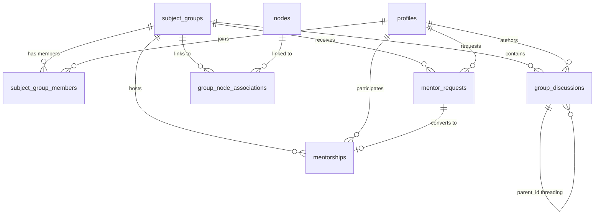

# SUBJECTS GROUP / SUBJECTS FORUM — COMPLETE AUDIT

> Comprehensive developer audit of the Siddhant platform's Subject Groups and Forum system, answering all 15 sections of the manager's questions with code references, schema details, current problems, and implementation limitations.

---

## 1. Purpose & Product Role

### 1.1 Exact Purpose
The Subjects Group page serves as **domain-specific contributor communities** for legal scholars. Each group represents a legal subject area (e.g., Constitutional Law, Criminal Law) where contributors coordinate research, track domain Reports (knowledge articles), mentor newcomers, and discuss legal developments. The page header says it explicitly: *"Coordinate research, engage in deep scholarly discourse, and build consensus within specialized legal domains."*

**Code reference:** [groups/page.tsx](file:///c:/Users/Nipun/OneDrive/Documents/Siddhant%20Save/Siddhant%20Save%2012/src/app/groups/page.tsx) (line 49-51)

### 1.2 Difference Between Subjects, Groups, Forums, Discussions

| Term | Actual Role | Implementation |
|------|------------|----------------|
| **Subject Groups** | Top-level organizational unit — a legal domain like "Constitutional Law" | `subject_groups` table with slug, name, description, icon |
| **Forums** | The internal workspace of a Subject Group, divided into "Rooms" | `ForumClient.tsx` with tabbed room navigation |
| **Group Discussions** | Individual posts/threads within a Forum Room | `group_discussions` table — flat messages with parent_id threading |
| **Discussions** (Topic-level) | A separate system — threaded legal reasoning on specific knowledge articles | `discussions` table, tied to `nodes` via `node_id` — **completely separate** |

> [!IMPORTANT]
> The naming is confusing. "Discussions" exists in TWO unrelated systems: `group_discussions` (forum posts inside groups) and `discussions` (legal reasoning boards on topic pages). They share no schema, no UI, and no logic.

### 1.3 What Model Does This Follow?

It is a **hybrid** of several models:
- **Reddit-style communities** — groups you join/leave, with threaded posts
- **Academic departments** — domain-specific (Constitutional Law, Criminal Law, etc.)
- **Knowledge collaboration spaces** — via the Coordination Room's "Domain Reports Tracker" linking to knowledge articles
- **Mentoring circles** — via the Mentoring Room with formal mentor-request/accept flows

It is **NOT** a general discussion forum. It has a strong governance model with roles (member → mentor → coordinator) and room-level access control.

### 1.4 What Users Do Most Frequently
Currently: **Join groups, post messages in Open Discussion, and browse the Coordination room's linked Reports.** The mentoring system exists but is secondary.

### 1.5 Primary Value Proposition
Organizing contributors by legal domain so they can coordinate which knowledge articles need work, mentor newcomers into the domain, and discuss legal developments — essentially **self-governing scholarly guilds**.

---

## 2. Current Features

### 2.1 Features That Currently Exist

| Feature | Status | Code Reference |
|---------|--------|----------------|
| Group listing page with cards | ✅ Working | [groups/page.tsx](file:///c:/Users/Nipun/OneDrive/Documents/Siddhant%20Save/Siddhant%20Save%2012/src/app/groups/page.tsx) |
| Individual group forum pages | ✅ Working | [groups/[slug]/page.tsx](file:///c:/Users/Nipun/OneDrive/Documents/Siddhant%20Save/Siddhant%20Save%2012/src/app/groups/%5Bslug%5D/page.tsx) |
| Join/Leave group | ✅ Working | [actions.ts](file:///c:/Users/Nipun/OneDrive/Documents/Siddhant%20Save/Siddhant%20Save%2012/src/app/groups/%5Bslug%5D/actions.ts) lines 93-158 |
| Room-based navigation (5 rooms) | ✅ Working | `ForumClient.tsx` lines 50-56 |
| Typed thread posts | ✅ Working | `group_discussions.thread_type` — general, coordination, mentoring, announcement |
| Pinned posts | ✅ Working | `pinned` boolean column, coordinator-only via RLS |
| Threaded replies (nested) | ✅ Working | Uses `DiscussionEngine` component |
| Member roster sidebar | ✅ Working | Shows up to 15 members with roles |
| Domain Reports Tracker | ✅ Working | `group_node_associations` table, Coordination room |
| Associate/Remove Reports | ✅ Working | Coordinator/mentor can link topic articles |
| Mentor request system | ✅ Working | `mentor_requests` + `mentorships` tables |
| Accept mentor request | ✅ Working | Any group member can accept |
| Role-based access (rooms) | ✅ Working | Coordination & Announcement = members-only |
| Auto coordinator promotion | ✅ Working | Level 4+ with 3+ mentees → auto promoted |
| Stats sidebar (members, reports) | ✅ Working | Sidebar card with counts |

### 2.2 Capability Matrix

| Capability | Supported? |
|-----------|-----------|
| Create subjects | ❌ Admin-only via SQL seed |
| Join subjects | ✅ One-click join |
| Follow subjects | ❌ Not implemented |
| Post discussions | ✅ In specific rooms |
| Upload resources | ❌ Not supported |
| Ask questions | ⚠️ Only as plain text posts — no typed question system |
| Endorse answers | ❌ No endorsement in group forums (only in topic discussions) |
| Create subtopics | ❌ No hierarchy within groups |

### 2.3 Special Features

| Feature | Status |
|---------|--------|
| Pinned posts | ✅ Yes — coordinator-only |
| Announcements | ✅ Via dedicated "Announcement" room |
| Trending discussions | ❌ No trending/hot algorithm |
| Featured contributors | ❌ Not surfaced |

### 2.4-2.8 Other Features

- **Moderation:** Only coordinators can pin threads. No content deletion, reporting, or approval workflow exists.
- **Search:** ❌ No search within forums.
- **Filtering/Sorting:** ❌ Only room-based filtering. No sort by date, popularity, etc.
- **Pagination:** ❌ All threads load at once. No pagination or infinite scroll.
- **Notifications:** ❌ Not connected to any notification system.

---

## 3. User Flow

### 3.1 Entry Points
- **Navbar:** "Forums" link with a pulse dot indicator → `/groups`
- **Cross-references:** Dashboard and sidebar links within group pages link to `/groups`
- No deep links from Recognition, Graph, or Topic pages to relevant groups

### 3.2 Expected User Journey
1. User clicks "Forums" in navbar → lands on listing page
2. Sees grid of 6 subject-area cards with member/discussion counts
3. Clicks a group card → enters the group forum
4. Sees sidebar (group info, stats, member roster) + main content area
5. Navigates between 5 rooms via tab buttons
6. Posts messages, reads threads, or interacts with mentoring system

### 3.3 New User Experience
A new user sees:
- The group listing with cards — **no personalization, no recommendations**
- Inside a group: all rooms visible, can read everything, but can only post in Open Discussion and Mentoring rooms without joining
- A "JOIN GROUP" CTA button in the sidebar

### 3.4 Most Common Actions
1. Reading threads in a room
2. Posting in Open Discussion
3. Viewing the Domain Reports Tracker in Coordination

### 3.5 Currently Difficult/Confusing Actions
- **No way to discover which groups are relevant** — no recommendations, no trending
- **Room navigation feels flat** — no indication of activity levels per room
- **No visual feedback after posting** — relies on `router.refresh()` which can feel slow
- **Associate Report** requires knowing the slug or URL — no search/autocomplete

### 3.6 Drop-off Points
No analytics exist, but likely:
- Users may drop off at the listing page if they don't know which group to join
- Within groups, the empty state is a blank "No messages here yet" message — not inviting

---

## 4. Information Architecture

### 4.1 Current Organization
**Flat two-level hierarchy:**
```
Subject Groups (6 seeded)
  └── Rooms (5 fixed types: All, Coordination, Mentoring, Announcements, Open Discussion)
       └── Threads (flat messages with parent_id replies)
```

### 4.2 Hierarchy Details
- **No** Subject → Topic → Thread hierarchy
- **No** Domain → Subject → Discussion nesting
- Rooms are hardcoded in `ForumClient.tsx` (lines 50-56), not database-driven
- Threads are flat within rooms, filtered by `thread_type` column

### 4.3 Cross-group Membership
A discussion **cannot** belong to multiple groups. The `group_discussions` table has a single `group_id` foreign key.

However, **Reports can belong to multiple groups** via `group_node_associations` (many-to-many junction table).

### 4.4 Tags
❌ No tag system exists.

### 4.5 Static vs User-Generated
**Groups are static** — created only via SQL seed (`community_schema_migration.sql` lines 235-254). There is no UI for creating new groups. The 6 seeded groups are:
1. Constitutional Law
2. Criminal Law
3. Labour & Industrial Law
4. Family Law & Personal Laws
5. Contract & Commercial Law
6. Administrative & Service Law

### 4.6 Scalability
**Poor scalability:**
- All threads load in a single query with no pagination (line 50-57 of `page.tsx`)
- Room filtering is client-side only
- No database indexes on `thread_type` for query optimization
- The `DiscussionEngine` has a performance warning at 250+ messages (line 655)

---

## 5. Visual Design & Layout

### 5.1 Layout Descriptions

**Desktop — Groups Listing (`/groups`):**
- Full-width centered layout (`max-width: 1100px`)
- Centered header with badge, title, description
- CSS Grid of cards (`repeat(auto-fill, minmax(320px, 1fr))`)
- Each card: icon, name, description, member count, discussion count
- Cards have hover lift effect with gradient top-border reveal
- Uses `groups.css` — **a completely different design system** from the community pages

**Desktop — Individual Group Forum (`/groups/[slug]`):**
- Two-column grid layout via `community-core.css` (`grid-template-columns: 320px 1fr`)
- Left sidebar: group icon/name card, stats ledger, join/leave button, member roster, cross-reference links
- Right main: header with title + "Subject Workspace / ACTIVE" badge, room navigation tabs, room content area, threaded discussions via `DiscussionEngine`
- Uses `community-core.css` design system — **premium glassmorphism aesthetic** matching the Discussion pages

**Mobile (≤1024px):**
- Collapses to single column (`grid-template-columns: 1fr`)
- Sidebar stacks above main content
- Room tabs become horizontally scrollable

### 5.2 Layout System
- Groups listing: standard CSS Grid with `groups.css`
- Individual forum: `community-core.css` grid system — same as Discussion pages
- Uses CSS custom properties from `globals.css` design system v3

### 5.3 UI Library/Components
- **No external UI library** — all custom CSS
- Reuses `DiscussionEngine` and `DiscussionForm` from `components/community/`
- Uses glass-card pattern from `community-core.css`
- Custom scholar-avatar, stats-ledger, nav-link components

### 5.4 Visually Weak Areas
- **Groups listing page** uses the older `groups.css` design system — purple gradient accent (`#a855f7`) instead of the gold scholarly palette
- Cards are functional but **generic** — no activity indicators, no "recently active" signals
- Empty rooms show a minimal "🏺 No messages" state — not engaging

### 5.5 Spacing/Readability
- Generally good within individual components
- The room navigation buttons use inconsistent spacing (flex-wrap with 8px gap)
- Thread density can feel overwhelming with no visual separators between discussions

### 5.6 Component Reusability
- `DiscussionEngine` is highly reusable — used in 3 spaces (report, user, group)
- `DiscussionForm` is reusable with mode variants
- Glass-card pattern is reusable
- **However,** the groups listing page cards are NOT reused anywhere

### 5.7 Dark Mode
✅ **Fully supported** via `globals.css` design tokens. Both `@media (prefers-color-scheme: dark)` and `.dark` class are implemented.

### 5.8 Visual Consistency With Other Pages

| Page | Consistent? | Notes |
|------|------------|-------|
| Recognition Page | ⚠️ Partial | Both use gold accents but different layouts |
| Graph Page | ❌ No | Graph is a full-viewport canvas — different paradigm |
| Discussion (Topic) Page | ✅ Yes | Same `community-core.css` + `DiscussionEngine` |
| Groups Listing Page | ❌ Inconsistent | Uses `groups.css` with purple accents, not community-core |

### 5.9 Visually Inconsistent Areas
- **Groups listing** uses purple accent (`#a855f7`) while individual forum pages use gold (`--color-gold`)
- The listing page badge says "🏛 Subject Forums" in purple; the forum page says "Subject Workspace" in gold
- Two different card systems: `group-card` (listing) vs `glass-card` (forum)

---

## 6. Subject Discovery

### 6.1 How Users Discover Subjects
Only via the `/groups` listing page — a flat grid of all 6 groups. No other discovery mechanism.

### 6.2 Discovery Features

| Feature | Status |
|---------|--------|
| Search | ❌ |
| Recommendations | ❌ |
| Trending subjects | ❌ |
| Recently active | ❌ |
| Categories | ❌ (groups ARE the categories) |

### 6.3 Personalized Feeds
❌ No personalization. Every user sees the same grid.

### 6.4 Onboarding
❌ No onboarding. New users are not guided to relevant groups.

---

## 7. Discussion System

### 7.1 System Used
Group forums use the **same `DiscussionEngine` component** as topic discussion pages, but in a **simplified mode** (`space="group"`, `showBottomForm={false}`).

**Code:** [ForumClient.tsx](file:///c:/Users/Nipun/OneDrive/Documents/Siddhant%20Save/Siddhant%20Save%2012/src/app/groups/%5Bslug%5D/ForumClient.tsx) line 556-562

### 7.2 Threading Model
- **Nested/threaded** — uses `parent_id` foreign key for recursive nesting
- Tree built client-side in `DiscussionEngine` (line 660-672)
- Threads auto-collapse at depth ≥ 4

### 7.3 Can Discussions Reference Entities?
- ❌ **Not in group forums.** The `group_discussions` table has no `reference_text`, `reference_type`, or `node_id` columns
- The topic-level `discussions` table DOES have these columns, but they're in a completely separate system
- The Domain Reports Tracker links groups to nodes, but individual forum posts cannot reference specific legal concepts

### 7.4 Quoting/Highlighting
❌ Not supported in group forums. The `DiscussionEngine` has reference blocks but they're only available in topic discussion mode.

### 7.5 Rich Text Editor
❌ No rich text editor. Plain `<textarea>` only. No markdown, no formatting toolbar.

### 7.6 Connected to Reputation
❌ **Group forum activity does NOT affect reputation.** The endorsement system (`consensus_votes`) only exists for the `discussions` table, not `group_discussions`.

---

## 8. Contribution & Reputation

### 8.1 Recognition from Subject Activity
❌ **No.** Group activity is completely isolated from the reputation system.

### 8.2 Reputation Features in Groups

| Feature | Status |
|---------|--------|
| Reputation scores visible | ⚠️ Visible in member roster (fetched) but not prominently shown |
| Expertise scoring | ❌ |
| Contributor ranking | ❌ |
| Badges | ❌ |
| Role badges | ✅ Member/Mentor/Coordinator shown with colored badges |

### 8.3 Top Contributors
Not surfaced. Members are sorted by role priority (coordinator → mentor → member) then join date, not contribution volume.

### 8.4 Quality vs Quantity
No differentiation. No endorsement or voting system within group forums.

### 8.5 Subject Experts
Only through the role system. Coordinators (auto-promoted after Level 4 + 3 mentees) are the closest to "experts."

---

## 9. Content Types

### 9.1 Supported Content Types

| Type | Supported? |
|------|-----------|
| Plain text | ✅ |
| Markdown | ❌ |
| Citations | ❌ |
| PDFs | ❌ |
| Images | ❌ |
| Videos | ❌ |
| Structured legal references | ❌ |

### 9.2 Graph Node Attachment
Not directly. Users can **link Reports to a group** (via Coordination room), but individual posts cannot attach or reference specific graph nodes.

### 9.3 Structured Knowledge
❌ Users can only create unstructured text posts. No ability to create structured knowledge entries.

---

## 10. Technical Architecture

### 10.1 Frontend Framework
**Next.js** (App Router with Server Components + Client Components)
- Listing page: Server Component (RSC)
- Forum page: Server Component wrapper + `ForumClient` (Client Component with `'use client'`)

### 10.2 Backend Architecture
**Supabase** (PostgreSQL + Row Level Security)
- Server actions via `'use server'` functions
- Direct Supabase client queries from Server Components
- No API routes — all data fetching is server-side

### 10.3 Database Schema

**`subject_groups`** — Group definitions
```sql
id uuid PK, slug text UNIQUE, name text, description text, icon text, created_at timestamptz
```

**`subject_group_members`** — Membership + roles
```sql
user_id uuid FK→profiles, group_id uuid FK→subject_groups, 
role text CHECK ('member','mentor','coordinator'), joined_at timestamptz
PK (user_id, group_id)
```

**`group_discussions`** — Forum posts
```sql
id uuid PK, group_id uuid FK, author_id uuid FK→profiles, content text,
thread_type text CHECK ('general','coordination','mentoring','announcement'),
parent_id uuid FK→self, pinned boolean, created_at timestamptz
```

**`group_node_associations`** — Report linking
```sql
id uuid PK, group_id uuid FK, node_id uuid FK→nodes, added_by uuid FK→profiles,
created_at timestamptz, UNIQUE (group_id, node_id)
```

**`mentor_requests`** — Mentoring requests
```sql
id uuid PK, requester_id uuid FK, group_id uuid FK, status text CHECK ('open','accepted','withdrawn'),
message text, accepted_by uuid FK, created_at timestamptz, resolved_at timestamptz
```

**`mentorships`** — Active mentoring pairs
```sql
id uuid PK, mentor_id uuid FK, mentee_id uuid FK, group_id uuid FK, request_id uuid FK,
status text CHECK ('active','ended'), started_at timestamptz, ended_at timestamptz, ended_by uuid FK
```

### 10.4 Real-time Updates
❌ No real-time. Uses `router.refresh()` after mutations, which triggers a full RSC re-render.

### 10.5 Caching
Only Next.js default RSC caching + `revalidatePath()` after mutations.

### 10.6 Search Engine
❌ No search implementation.

### 10.7 Performance Issues
- **All threads loaded at once** — no pagination, no lazy loading
- **Client-side tree building** — the `DiscussionEngine` builds the reply tree in the browser
- **N+1 query patterns** — member counts and thread counts are fetched per-group on the listing page
- **250+ message warning** — the engine logs a console warning but doesn't degrade gracefully

### 10.8 Scaling Concerns
- The listing page fetches ALL members and ALL threads to count them (lines 23-41 of `groups/page.tsx`)
- No database indexes on `thread_type` or `pinned` columns
- Forum page fetches ALL discussions for a group in one query (no limit/offset)

---

## 11. Moderation & Governance

### 11.1 Who Can Create Subjects
**Only via SQL seed** — no UI for creating groups. The 6 groups are hardcoded in `community_schema_migration.sql`.

### 11.2 Who Moderates
**Coordinators** — auto-promoted users who are Level 4+ (Senior Scholar) AND have mentored 3+ people in the group. They can:
- Pin/unpin threads
- Remove Report associations
- Post in all rooms

### 11.3 Admin Roles
Three roles exist in `subject_group_members.role`:
- `member` — default on join
- `mentor` — auto-promoted when accepting a mentor request
- `coordinator` — auto-promoted via `checkCoordinatorPromotion()` in [mentor-actions.ts](file:///c:/Users/Nipun/OneDrive/Documents/Siddhant%20Save/Siddhant%20Save%2012/src/app/actions/mentor-actions.ts) lines 133-171

### 11.4 Reporting
❌ No content reporting system.

### 11.5 Spam Protection
❌ No spam protection. Any authenticated user can post in open rooms.

### 11.6 Content Approval
❌ No approval workflow. Posts are immediately visible.

---

## 12. Analytics & Usage

### 12.1-12.5 Analytics
❌ **No analytics exist.** No heatmaps, no session recordings, no engagement tracking. No user feedback collection mechanism.

The only "metrics" are the member count and discussion count shown on group cards, which are live database counts.

---

## 13. Integration With Siddhant Ecosystem

### 13.1 Connection Matrix

| System | Integration Level | Details |
|--------|-----------------|---------|
| **Recognition** | ❌ None | Group activity not in recognition feed |
| **Graph** | ⚠️ One-way | Groups can link to nodes via `group_node_associations`, but graph doesn't show group affiliations |
| **Topic Discussions** | ❌ None | Completely separate `discussions` vs `group_discussions` tables |
| **Profiles** | ⚠️ Minimal | Profile page shows username but doesn't list group memberships |
| **Knowledge entities** | ⚠️ One-way | Reports linked to groups, but no reverse visibility on topic pages |
| **Dashboard** | ❌ None | Dashboard has no group activity section |

### 13.2 Activity → Reputation
❌ **No.** Group forum posts, mentoring, and coordination do not generate reputation points, recognition feed events, or any ecosystem-wide signals.

### 13.3 Isolation Level
**Groups are deeply isolated.** They exist as a self-contained subsystem with:
- Their own database tables (no shared tables with the main discussion system)
- Their own CSS (partially — uses `community-core.css` but also `groups.css`)
- Their own server actions (no shared action layer)
- No outbound signals to other systems

---

## 14. Biggest Problems

### Top 10 Current Problems

1. **Complete isolation from the ecosystem** — Group activity doesn't feed into Recognition, Reputation, or the Knowledge Graph. A user could be the most active forum contributor and have zero visible credibility.

2. **No search** — Cannot search within forums, across groups, or for specific discussions.

3. **No pagination** — All threads load at once. Will break at scale.

4. **No endorsement/voting in group forums** — The `DiscussionEngine` supports endorsements, but `group_discussions` lacks the necessary `consensus_votes` integration. Quality content can't surface.

5. **Groups are admin-seeded only** — No way for the community to propose or create new subject groups as the platform grows.

6. **No notifications** — Users get no alerts for new posts, replies, or mentor requests in their groups.

7. **Visual inconsistency** — Listing page uses purple accents (`#a855f7`), forum pages use gold (`--color-gold`). Two different design systems.

8. **No discovery/recommendations** — No way for users to find relevant groups beyond browsing the flat list.

9. **No content richness** — Plain text only. No markdown, no citations, no attachments, no rich text. Scholarly discourse requires citation support.

10. **Mentoring has no follow-through** — After pairing, there's no guided curriculum, no check-ins, no progress tracking. The mentoring relationship is a database row with no tooling.

### What Feels Incomplete
- The Coordination room's "Associate Report" feature works but feels bare — no search, no preview, no batch operations
- Member roster shows 15 max with no expandability
- No way to see a group's full activity history or archives
- No cross-group discovery or "related groups" suggestions

### What Feels Confusing
- The room navigation doesn't indicate unread/new activity
- "All Activity" room mixes all thread types — hard to scan
- Non-members seeing "This space is for group members" but no context on what they're missing

### What Feels Technically Weak
- Client-side tree building for all messages
- No database indexes optimized for forum queries
- Full-page revalidation after every post
- No optimistic UI updates

### What I Would Redesign From Scratch
- **Merge the two discussion systems** — `group_discussions` and `discussions` should share a unified engine with the same endorsement, reference, and consensus capabilities
- **Build a notification layer** — forum activity should generate notifications
- **Add endorsements to group posts** — leverage the existing `DiscussionEngine` endorsement UI
- **Implement server-side pagination** with cursor-based loading
- **Connect to Recognition** — forum contributions should appear in the recognition feed
- **Add rich text with citations** — leverage the reference system from topic discussions

---

## 15. Future Vision

### 15.1 Intended Long-term Vision
Based on the architecture and research references in the code, Subjects are intended to become **self-governing scholarly communities** where contributors earn authority through demonstrated expertise (mentoring → coordinator promotion pipeline), coordinate knowledge production (Domain Reports Tracker), and build consensus within specialized legal domains.

### 15.2 What Subjects Should Become
Based on the existing infrastructure and Siddhant's scholarly mission:
- **Scholarly communities** — yes, this is the strongest fit
- **Collaborative research spaces** — yes, via the Coordination room
- **Legal learning hubs** — yes, via the Mentoring system
- **Expert networks** — partially, through the coordinator promotion pipeline

### 15.3 AI Assistance Inside Subjects
Currently ❌ no AI integration. But the architecture supports:
- AI-assisted topic recommendations for new members
- AI-generated discussion summaries
- Automated quality scoring of forum contributions
- Smart Report suggestions for the Coordination room

### 15.4 Automatic Structured Knowledge Generation
Currently ❌ not supported. Forum posts are unstructured text. Future potential: consensus-closed discussions could auto-generate knowledge graph edges or update topic articles.

---

## Component Structure

```
src/app/groups/
├── page.tsx                    # Groups listing (Server Component)
├── groups.css                  # Listing page styles (14.6 KB)
└── [slug]/
    ├── page.tsx                # Individual forum (Server Component, 12.2 KB)
    ├── ForumClient.tsx         # Client-side forum logic (28.9 KB)
    └── actions.ts              # Server actions (6.6 KB)

src/app/components/
├── community/
│   └── DiscussionEngine.tsx    # Shared discussion renderer (37 KB)
├── Navbar.tsx                  # "Forums" link with pulse dot

src/app/
├── community-core.css          # Shared community design system (10.5 KB)
├── globals.css                 # Global design tokens (7.2 KB)

src/app/actions/
└── mentor-actions.ts           # Mentor request/accept/end/withdraw (6.7 KB)
```

## Database Schema Summary



## Integration Gap Map

```
RECOGNITION ←── ✘ ──── GROUPS ────── ✘ ──→ DASHBOARD
                           │
                    weak link (reports only)
                           │
                       GRAPH/NODES ←── ✘ ──→ TOPIC DISCUSSIONS
                           │
                           ✘
                           │
                       PROFILES
```

---

> [!CAUTION]
> The single biggest systemic issue is that **Subject Groups are an island**. They don't feed into Recognition, don't affect Reputation, don't appear on Profiles, don't connect to the Dashboard, and don't share the endorsement/consensus system with Topic Discussions. Any redesign must start by **bridging these integrations** before adding new features.
