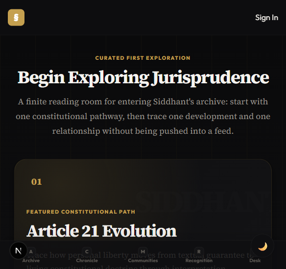
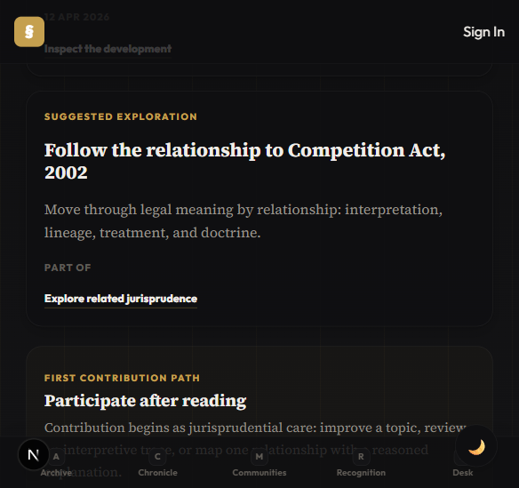

# Walkthrough - Explore Reading Room Refinement

## What Changed

The manager approved `/explore` as the correct architectural bridge, but warned that it must not become a recommendation feed, dashboard-lite, or generic discovery page. This pass refines `/explore` into a finite, curated constitutional reading room.

Primary changes:

- Made the Featured Constitutional Path visually dominant.
- Reframed the page from equal recommendation cards into a reading-room hierarchy.
- Moved Recent Scholarly Development and Suggested Exploration into quieter editorial trace panels.
- Reduced the First Contribution Path into a smaller closing invitation called "Participate after reading."
- Kept the page finite and high-signal: one path, one development, one relationship, one quiet contribution invitation.

## Strategic Intent

The page now supports this progression:

```text
Landing -> Onboarding philosophy -> Guided jurisprudential exploration -> Deep archive traversal
```

The key design decision was to make intellectual exploration dominate. Contribution remains present, but it no longer reads like a productivity CTA funnel.

## Screenshot - Reading Room Entry



This view shows the new hierarchy:

- "Curated First Exploration" sets editorial intent.
- The hero copy explicitly says the page is finite and not a feed.
- Article 21 Evolution is the primary surface.
- The reading sequence is shown as Text -> Interpretation -> Revision -> Relationship.
- Mobile bottom navigation remains text-first and visible.

## Screenshot - Quieter Contribution Invitation



This view shows the manager's contribution warning implemented:

- Suggested Exploration remains jurisprudential, not algorithmic.
- First Contribution Path appears after exploration.
- The section is smaller, quieter, and framed as "Participate after reading."
- Contribution is positioned as jurisprudential care, not task completion.

## Files Updated

- `src/app/explore/page.tsx`
- `src/app/explore/explore.css`

## Verification

`npm run build` passed successfully with Next.js 16.2.1.

Screenshots were captured from the local app at:

- `Research/screenshots/explore-reading-room-viewport.png`
- `Research/screenshots/explore-reading-room-lower.png`
